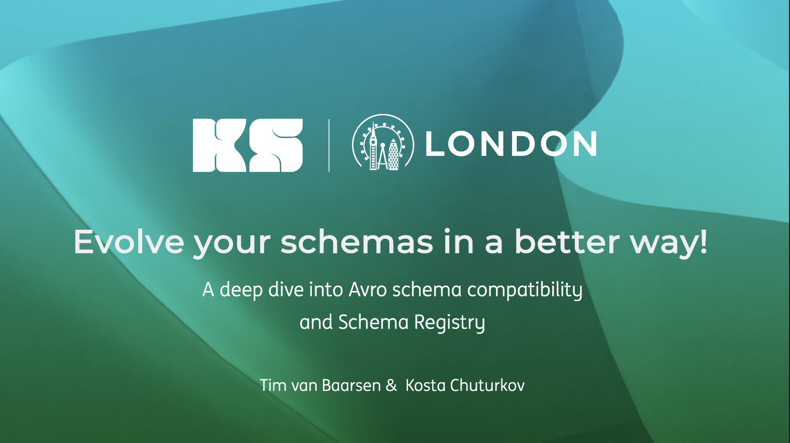

# Kafka Summit London 2024

Demo code for our talk at the Kafka Summit 2024 in London.

**Talk**: Evolve your schemas in a better way! - A deep dive into Avro schema compatibility and Schema Registry

**Speakers**: Kosta Chuturkov & Tim van Baarsen

**Slides**: [Slides](https://speakerdeck.com/timvanbaarsen/kafka-summit-london-2024-evolve-your-schemas-in-a-better-way)

**Demos**:
* [Demo 1 - Backward Compatibility by Kosta](demo-1-backward.md)
* [Demo 2 - Forward Compatibility by Kosta](demo-2-forward.md)
* [Demo 3 - Compatibility testing by Tim](demo-3-compatibility-testing.md)
